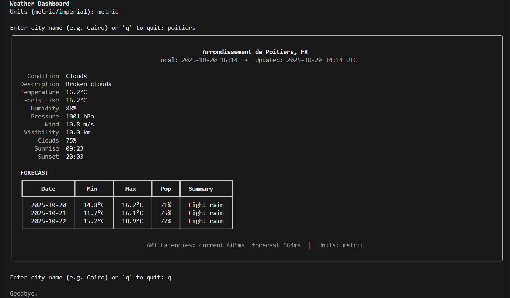

# 🌦️ Weather Dashboard — CLI Weather Client


**Author:** Mohamed Elmarakby  
**Version:** 1.0

---

## 💡 Motivation

After building my previous CLI utilities, I wanted to explore **real-time API integration**, **data visualization in the terminal**, and **clean CLI UX**.  
The result is this **Weather Dashboard**, a modern command-line app that displays live weather conditions and forecasts beautifully and reliably.

---

## 📖 Introduction

The **Weather Dashboard** is a Python-based CLI application powered by the [OpenWeatherMap API](https://openweathermap.org/api).  
It provides **real-time weather**, **3-day forecasts**, and **auto-location detection** — all rendered using the `Rich` library for an elegant, minimalistic terminal UI.

---

## 📚 Table of Contents

- [Motivation](#-motivation)
- [Introduction](#-introduction)
- [Demo](#-demo)
- [Features](#-features)
- [Installation](#-installation)
- [Usage](#-usage)
- [Example Output](#-example-output)
- [Dependencies](#-dependencies)
- [Configuration](#-configuration)
- [Troubleshooting](#-troubleshooting)
- [What I Learned](#-what-i-learned)
- [Future Improvements](#-future-improvements)
- [Author](#-author)
- [License](#-license)

---

## 🖥️ Demo

<p align="center">
  
</p>

Example terminal output:

```
Weather Dashboard
Units (metric/imperial): metric
Enter city name (e.g. Cairo):

╭────────────────────────────── Weather Dashboard ────────────────────────────╮
│  Cairo, EG                                                                  │
│  Local: 2025-10-20 14:45  •  Updated: 2025-10-20 12:45 UTC                  │
│                                                                             │
│  Condition     : Clear                                                      │
│  Temperature   : 27.3°C                                                     │
│  Feels Like    : 27.0°C                                                     │
│  Humidity      : 35%                                                        │
│  Pressure      : 1014 hPa                                                   │
│  Wind          : 3.2 m/s                                                    │
│  Visibility    : 10.0 km                                                    │
│  Clouds        : 0%                                                         │
│  Sunrise       : 05:42                                                      │
│  Sunset        : 17:33                                                      │
│                                                                             │
│  FORECAST                                                                   │
│  Date        Min      Max      Pop     Summary                              │
│  2025-10-21  23.1°C   30.0°C   0%      Clear sky                            │
│  2025-10-22  22.8°C   31.2°C   0%      Sunny                                │
│  2025-10-23  22.0°C   30.5°C   10%     Few clouds                           │
│                                                                             │
│  API Latencies: current=120ms  forecast=210ms  |  Units: metric             │
╰─────────────────────────────────────────────────────────────────────────────╯
```

---

## ✨ Features

- 🌍 **Real-Time Weather Fetching**
  - Retrieves current conditions: temperature, humidity, wind, and more.
  - Supports **metric** and **imperial** units.
- 📅 **3-Day Forecast**
  - Aggregates and simplifies forecast data.
  - Displays min/max temps, precipitation, and weather summaries.
- 🧠 **Smart Auto-Detection**
  - Detects user location using IP-based geolocation.
- 💎 **Polished CLI Interface**
  - Built with the `rich` library for a professional dashboard layout.
- ⚙️ **Smart Error Handling**
  - Graceful handling of bad input, missing API keys, and network errors.
- ⏱️ **Performance Metrics**
  - Tracks API response time for full transparency.

---

## ⚙️ Installation

1. Clone the repository:
   ```bash
   git clone https://github.com/elmarakbymohamed/weather-dashboard-cli.git
   cd weather-dashboard-cli
   ```

2. Create a virtual environment (recommended):
   ```bash
   python -m venv venv
   source venv/bin/activate  # On Windows: venv\Scripts\activate
   ```

3. Install dependencies:
   ```bash
   pip install -r requirements.txt
   ```

4. Create a `.env` file and add your OpenWeatherMap API key:
   ```bash
   OPENWEATHER_API_KEY=your_api_key_here
   ```

---

## 🚀 Usage

Run the tool from your terminal:

```bash
python weather_dashboard.py
```

Then enter the desired city or press Enter to use the auto-detected one.

---

## 📦 Dependencies

| Package | Version | Purpose |
|----------|----------|----------|
| `requests` | 2.31.0 | HTTP API calls |
| `rich` | 13.7.1 | Terminal UI rendering |
| `python-dotenv` | 1.0.0 | Environment variable management |

Alternatively, install manually:
```bash
pip install requests rich python-dotenv
```

---

## ⚙️ Configuration

| Variable | Description |
|-----------|-------------|
| `OPENWEATHER_API_KEY` | Required — your OpenWeatherMap API key |

---

## 🩺 Troubleshooting

| Issue | Possible Cause | Solution |
|-------|----------------|----------|
| `Missing OPENWEATHER_API_KEY` | `.env` not configured | Create `.env` and add key |
| `City not found.` | Typo or invalid city | Try again with a valid city name |
| `API request failed` | Network issue or rate limit | Check internet or wait a few minutes |

---

## 🧠 What I Learned

- How to design **modular CLI architectures** in Python.  
- Using `Rich` for advanced **terminal UIs** and visual feedback.  
- Handling **API latency tracking** and structured error resilience.  
- Managing environment variables securely using `dotenv`.  
- Summarizing large JSON data into **compact, human-readable output**.

---

## 🚧 Future Improvements

- 🕒 Add caching to reduce API calls and speed up repeated queries.  
- 🌍 Support multi-city comparisons.  
- 🧩 Implement graphical TUI charts for temperature trends.  
- 🔁 Add live refresh mode (auto-update every X minutes).  
- 💾 Store user preferences for units and last city.

---

## 👤 Author

**Mohamed Elmarakby** — Developer & Maintainer  
[GitHub Profile](https://github.com/elmarakbymohamed)

---

## 📜 License

This project is licensed under the [MIT License](https://opensource.org/license/MIT).  
Feel free to use, modify, and distribute for educational or personal projects.

---
